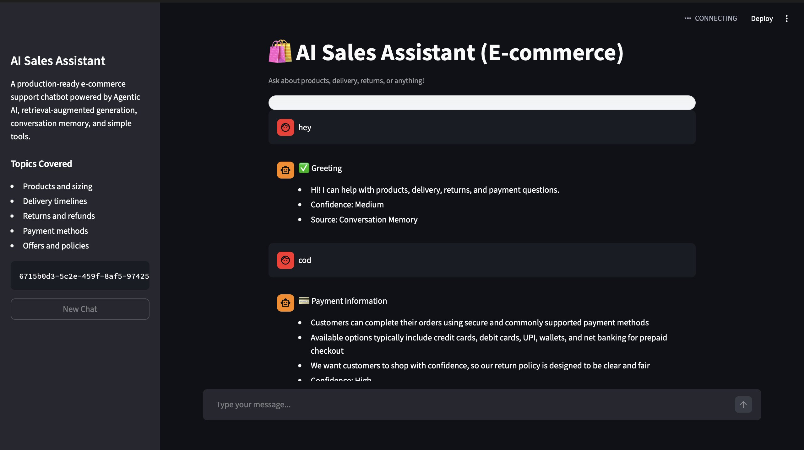
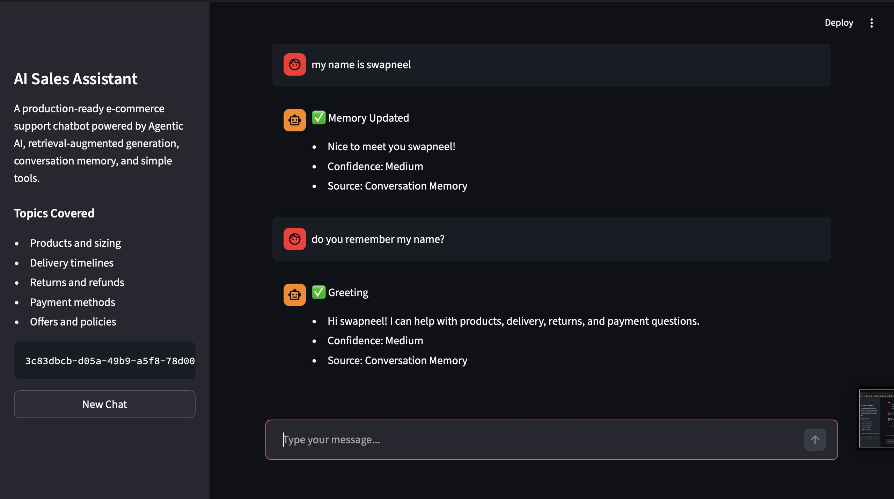

# 🛍️ AI Sales Assistant (E-commerce)


## 🚀 Project Overview

AI Sales Assistant is a production-ready, portfolio-quality e-commerce support chatbot built with Agentic AI principles. It combines:

- LangGraph-based routing
- Retrieval-augmented generation using ChromaDB
- sentence-transformers embeddings
- conversation memory
- basic tool use for utility tasks
- a polished Streamlit chat interface

The assistant can answer questions about delivery, returns, payments, and policies while remembering simple user details like names and preferences.

## 🧠 Features

- Rule-based LangGraph workflow for memory, retrieval, tool use, and fallback handling
- Robust `.docx` ingestion with corrupted-file skipping
- Automatic fallback knowledge base when user docs are missing or invalid
- Persistent ChromaDB vector store under `db/chroma_db`
- Offline-safe embedding fallback when the transformer model is unavailable
- Memory support for user names and preferences
- Tool support for calculations and date/time questions
- Streamlit UI with chat history, new chat reset, spinner, toast, and typing animation
- Confidence labels and source attribution in every answer
- Pytest coverage for retrieval, memory, fallback, and tool usage

## 🏗️ Architecture Diagram (ASCII)

```text
                +----------------------+
                |   data/DOCS/*.docx   |
                +----------+-----------+
                           |
                           v
                +----------------------+
                |   app/pipeline.py    |
                |  parse + clean docs  |
                |  build embeddings    |
                +----------+-----------+
                           |
                           v
                +----------------------+
                |    db/chroma_db      |
                |   persistent vector  |
                |      collection      |
                +----------+-----------+
                           |
                           v
 +-----------+    +----------------------+    +----------------------+
 |  User UI  +--->+     app/agent.py     +--->+  Retrieval / Memory  |
 | Streamlit |    |  LangGraph routing   |    |    Tool / Fallback   |
 +-----------+    +----------------------+    +----------------------+
                           |
                           v
                +----------------------+
                |  Professional answer |
                | confidence + sources |
                +----------------------+
```

## ⚙️ Tech Stack

- Python
- LangGraph
- ChromaDB
- sentence-transformers
- python-docx
- Streamlit
- Pytest

## 📦 Installation

```bash
git clone <your-repo-url>
cd AI-Sales-Support-Assistant-for-E-commerce-Brands
python3 -m venv .venv
source .venv/bin/activate
pip install -r requirements.txt
```

## ▶️ How to Run

Build the knowledge base:

```bash
python3 app/pipeline.py
```

Run the Streamlit interface:

```bash
streamlit run ui/streamlit_app.py
```

Or use the helper script:

```bash
bash run.sh
```

Run tests:

```bash
pytest -q
```

## 💬 Demo Questions

- What is your return policy?
- How long is delivery?
- What payment methods do you support?
- My name is Alex
- What is my name?
- calculate 25 * 4

## 📸 Screenshots

### Chat Overview



Main Streamlit interface showing greeting flow, retrieval-backed payment response, confidence level, and source attribution.

### Memory Demo



Conversation memory in action, where the assistant stores the user's name and recalls it in a follow-up message.

## 📊 Future Improvements

- Add LLM-based response generation with source-grounded synthesis
- Support order tracking tools and live APIs
- Store richer user profiles in a database
- Add admin analytics for repeated customer intents
- Support multilingual customer support

## 👨‍💻 Author

**Swapneel Purohit**

Built as an AI systems project focused on practical retrieval, agent orchestration, and deployable product UX.
